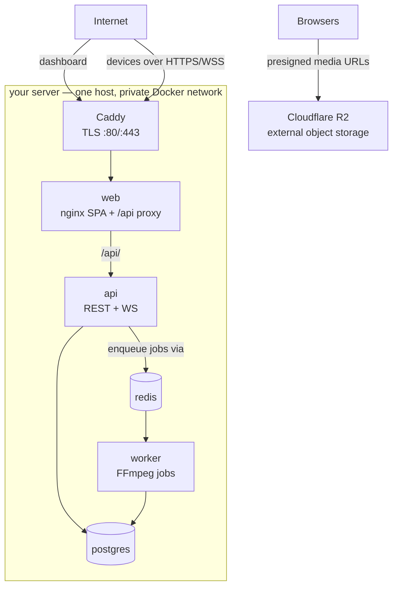

# Cloud server deployment guide

This guide deploys the full Hamfield Signage platform to a single cloud Linux
server using Docker Compose, with HTTPS and automatic TLS. It is production
oriented: real secrets, no public database ports, automatic certificate renewal,
external object storage (Cloudflare R2), and backups.

For local development use the [README](../README.md) quick start instead. For the
device/player side see [device-install.md](device-install.md).

---

## 0. How configuration works (read this first)

Configuration comes in two flavours: **committed templates** (in git) and the
**real files you create** on the server (git-ignored, never committed):

| Committed template (in git)                    | Real file you create (git-ignored)     | Holds                             |
| ---------------------------------------------- | -------------------------------------- | --------------------------------- |
| `.env.prod.example`                            | `.env.prod`                            | **every secret & host value**     |
| `docker-compose.example.yml`                   | `docker-compose.yml`                   | the service topology              |
| `infra/docker/docker-compose.prod.example.yml` | `infra/docker/docker-compose.prod.yml` | production wiring — no secrets    |
| `infra/docker/Caddyfile.example`               | `infra/docker/Caddyfile`               | your domain + Let's Encrypt email |

You create them by copying the templates and editing the values marked
`# ❗CHANGE`. The `git pull` in [§9](#9-updates--redeploys) updates the templates
and your code, but never touches your real files.

> **Already running a deployment whose `docker-compose.prod.yml` has secrets
> written into it?** That was the previous model. Do not rebuild the server —
> follow [§15](#15-migrating-an-existing-deployment-to-the-envprod-model), which
> is a config-only migration with a diff gate and a clean rollback.

**Secrets live in exactly one place: `.env.prod`.** You pass it to Compose with
`--env-file`, and the production override substitutes the values into the
services that need them. The compose files themselves hold no credentials, so
you can diff yours against the templates freely after a `git pull`.

> Do not confuse it with `.env`. That is the **local development** env file (see
> `.env.example`) — localhost URLs, MinIO defaults, ffmpeg paths — and Compose
> would load it automatically. Production uses a distinct filename and an
> explicit `--env-file`, which _replaces_ the default `.env`, so a stray dev copy
> on the server cannot leak localhost values into the running stack.

> `.env.prod` is the file to guard and to back up off-box — `chmod 600 .env.prod`.
> Losing it means losing the database password, which means losing the database.

> The production override references required values as `${VAR:?…}`, which makes
> Compose **refuse to start** when one is missing instead of quietly falling back
> to a development default. If `docker compose up` prints
> `required variable JWT_SECRET is missing a value`, that guard is doing its job.

> The old footgun — the Postgres password written twice, once as
> `POSTGRES_PASSWORD` and once inside `DATABASE_URL` — is gone: both are now
> derived from the single `POSTGRES_PASSWORD` in `.env.prod`, so they cannot drift.
> If you still hit `P1000: Authentication failed`, it means the password was
> changed _after_ the data volume was created — see [§14](#14-troubleshooting).

---

## 1. Architecture & topology

Everything runs as containers on one host, on a private Docker network. Only the
**reverse proxy** is exposed to the internet. Object storage is external
(Cloudflare R2), reached by browsers directly.



Key points:

- The **web container already proxies `/api/` to the API**, including the device
  WebSocket upgrade. So the dashboard, the REST API, and the device connections
  are all **one domain** (`signage.example.com`). Devices are configured with
  `--server https://signage.example.com` and talk out over HTTPS + WSS only.
- Media (thumbnails, previews, logos, video) lives in **Cloudflare R2**. The
  dashboard loads it via short-lived **presigned URLs** that point at the R2
  endpoint, so browsers reach R2 directly — there is **no media domain** and no
  MinIO container to run or back up.
- Devices download media **through the API**, not from R2 directly.

Containers:

| Service    | Role                                        | Public? |
| ---------- | ------------------------------------------- | ------- |
| `caddy`    | TLS reverse proxy (from the prod override)  | **yes** |
| `web`      | nginx serving the SPA + proxying `/api/`    | no      |
| `api`      | Fastify REST API + device WebSocket         | no      |
| `worker`   | BullMQ media processing (FFmpeg)            | no      |
| `postgres` | PostgreSQL 16 database                      | no      |
| `redis`    | Redis (job queue)                           | no      |
| `migrate`  | one-shot `prisma migrate deploy` on startup | no      |

> Using self-hosted MinIO instead of R2? See [§6](#6-object-storage-alternatives).

---

## 2. Prerequisites

- A cloud VM (Ubuntu 22.04/24.04 LTS or similar). Suggested minimum:
  **2 vCPU / 4 GB RAM / 40 GB disk**. Video transcoding is CPU-heavy — size up if
  you process many/large videos concurrently (and see `WORKER_CONCURRENCY`).
- A domain you control, with access to its DNS settings.
- A **Cloudflare R2** bucket plus an R2 API token (access key id + secret).
- Ports **80** and **443** open to the internet in your cloud firewall /
  security group. Nothing else needs to be public.
- `git`, Docker Engine, and the Docker Compose plugin installed:

```bash
curl -fsSL https://get.docker.com | sh
sudo usermod -aG docker "$USER"   # log out/in afterwards
docker compose version            # verify the plugin is present
```

---

## 3. DNS record

Point your domain at the server before requesting certificates. Replace
`signage.example.com` with your domain and `203.0.113.10` with your server's IP.

| Type | Name (host)           | Value          | TTL | Purpose                      |
| ---- | --------------------- | -------------- | --- | ---------------------------- |
| `A`  | `signage.example.com` | `203.0.113.10` | 300 | Dashboard + API + device WSS |

Notes:

- **IPv6:** if your server has a public IPv6 address, add a matching `AAAA`
  record (same name, the `2001:db8::…` address).
- **Cloudflare users:** set the record to **DNS only (grey cloud)** for the first
  certificate issuance. The orange-cloud proxy intercepts HTTP-01 validation and
  can also break the device WebSocket; only re-enable proxying after TLS works,
  and if you do, enable WebSockets and a matching SSL mode.
- Verify propagation before continuing (it can take minutes to hours):

```bash
dig +short signage.example.com   # must return your server IP
```

Certificates are issued automatically by Caddy via Let's Encrypt once this
record resolves to the server and ports 80/443 are reachable.

---

## 4. Get the code

```bash
git clone https://github.com/hamfield-eu/hamfield-signage.git
cd hamfield-signage
```

---

## 5. Create your config from the templates

Copy the four templates to their real (git-ignored) filenames:

```bash
cp .env.prod.example .env.prod
chmod 600 .env.prod

cp docker-compose.example.yml docker-compose.yml
cp infra/docker/docker-compose.prod.example.yml infra/docker/docker-compose.prod.yml
cp infra/docker/Caddyfile.example infra/docker/Caddyfile
```

Now edit them. **Everything you must change is marked `# ❗CHANGE`.**

### 5a. `.env.prod` — every secret, in one file

This is the only file with credentials in it, and the only one you must edit
carefully. Each entry is documented inline in the template; the required ones:

| Variable                          | Value                                                                       |
| --------------------------------- | --------------------------------------------------------------------------- |
| `POSTGRES_PASSWORD`               | `openssl rand -hex 32`. Used for the DB user **and** inside `DATABASE_URL`. |
| `JWT_SECRET`                      | A different `openssl rand -hex 32`.                                         |
| `API_PUBLIC_URL`                  | `https://signage.example.com` — your domain, HTTPS, no trailing slash.      |
| `CORS_ORIGINS`                    | The same origin. Your dashboard only; never a wildcard.                     |
| `S3_ENDPOINT`                     | `https://<ACCOUNT_ID>.r2.cloudflarestorage.com`                             |
| `S3_PUBLIC_ENDPOINT`              | For R2, the **same** account endpoint (see the note below).                 |
| `S3_ACCESS_KEY` / `S3_SECRET_KEY` | From R2 → "Manage R2 API Tokens" (Object Read & Write).                     |
| `INITIAL_SUPERADMIN_*`            | Your first login. Password ≥ 12 chars; rotate it after first login.         |

> ⚠ Keep `POSTGRES_PASSWORD` **URL-safe.** It is substituted into
> `postgresql://signage:<password>@postgres:5432/signage`, so a literal
> `@ : / ? # %` would corrupt the connection string. Hex output from
> `openssl rand -hex 32` is always safe.

> ⚠ **Quote anything with a `$` in it, in single quotes.** Compose reads an
> unquoted `$` as a variable reference and silently drops it —
> `POSTGRES_PASSWORD=abc$def` reaches the container as `abc`, and you find out
> when the database refuses the connection. Single quotes disable interpolation
> completely; double quotes do **not**. `openssl rand -hex 32` output never needs
> quoting.

> Why both `S3_ENDPOINT` and `S3_PUBLIC_ENDPOINT`? `S3_ENDPOINT` is used
> server-side (uploads/deletes); `S3_PUBLIC_ENDPOINT` is baked into the presigned
> URLs handed to browsers. For R2 both are the R2 account endpoint, so the
> presigned signature validates when the browser fetches the object.

Verify the result before starting anything — this resolves both compose files
and prints the fully merged configuration, secrets substituted:

```bash
docker compose --env-file .env.prod \
  -f docker-compose.yml \
  -f infra/docker/docker-compose.prod.yml config
```

A missing required value fails here, loudly, with the variable named. (The
output contains your secrets — don't paste it into a bug report.)

### 5b. `docker-compose.yml` (base) — remove MinIO

This deployment uses R2, so delete the bundled MinIO:

1. Delete the `minio:` and `minio-setup:` services.
2. Remove the `minio-setup:` entry from the `depends_on:` of **both** `api` and
   `worker`.
3. Remove `minio-data:` from the bottom `volumes:` list.
4. Delete the `mock-device:` service. It is profile-gated so it never starts by
   accident, but it has no place on a production host.

Everything else in this file is topology and stays as shipped.

### 5c. `infra/docker/docker-compose.prod.yml` (production wiring)

Usually **nothing to edit** — it reads every value from `.env.prod`. One exception:
if you are self-hosting MinIO instead of using R2 ([§6](#6-object-storage-alternatives)),
uncomment the `minio:` block so that ports `9000` (S3 API) and `9001` (admin
console) are not published to the internet. Leaving them published exposes the
MinIO console to the world.

### 5d. `infra/docker/Caddyfile` (TLS reverse proxy)

- Replace `app.example.com` with your real domain.
- Replace the `email` with a real address (Let's Encrypt expiry notices).

### 5e. Cloudflare R2 setup

1. Create the bucket (default name `signage-media`, or set `S3_BUCKET` to match).
2. Create an **R2 API token** (Object Read & Write) → copy the Access Key ID and
   Secret Access Key into the `x-r2-credentials` anchor.
3. Add a **CORS policy** on the bucket allowing `GET` from your dashboard origin,
   so browsers can fetch presigned object URLs:

   ```json
   [
     {
       "AllowedOrigins": ["https://signage.example.com"],
       "AllowedMethods": ["GET"],
       "AllowedHeaders": ["*"],
       "MaxAgeSeconds": 3600
     }
   ]
   ```

---

## 6. Object storage alternatives

R2 is the recommended default above. Two alternatives:

- **Other managed S3** (AWS S3, Backblaze B2, …): same as R2, but set
  `S3_ENDPOINT`/`S3_PUBLIC_ENDPOINT` to the provider's endpoint and
  `S3_FORCE_PATH_STYLE` per their docs (most virtual-hosted providers use
  `false`). Ensure bucket CORS allows `GET` from the dashboard origin.
- **Self-hosted MinIO:** keep the `minio` / `minio-setup` services from
  `docker-compose.example.yml`, add a second `media.example.com` site to the
  Caddyfile that `reverse_proxy minio:9000` (Caddy preserves the `Host` header so
  presigned signatures validate), add a matching DNS `A` record, and point
  `S3_ENDPOINT=http://minio:9000` / `S3_PUBLIC_ENDPOINT=https://media.example.com`.
  Back up the `minio-data` volume.

  > ⚠ **Also uncomment the `minio:` block in `infra/docker/docker-compose.prod.yml`**
  > ([§5c](#5c-infradockerdocker-composeprodyml-production-wiring)). The base file
  > publishes host ports `9000` (S3 API) and `9001` (**admin console**) for local
  > development, and unlike the other services the override does not clear them by
  > default. Skip this and you leave the MinIO console open to the internet.
  > Reach the console through an SSH tunnel instead:
  > `ssh -L 9001:localhost:9001 <server>`.

---

## 7. Bring the stack up

Use both compose files — the base plus the production override:

```bash
docker compose --env-file .env.prod \
  -f docker-compose.yml \
  -f infra/docker/docker-compose.prod.yml \
  up -d --build
```

Run it from the repository root, and never omit `--env-file` — every production
value comes from that file. If it is missing, or a required key is empty,
Compose stops here and names the variable; nothing starts half-configured.

This builds the images, starts postgres/redis, runs the `migrate` service
(`prisma migrate deploy`, applies all pending migrations), then starts the API,
worker, web, and Caddy. On first start Caddy requests a TLS certificate.

Define a `dc` shell **function** so you do not repeat the flags. Use exactly this
one on a production host: besides the flags, it refuses `-v` — the flag that
deletes your database ([§10](#10-persistence--data-safety)).

```bash
# ~/.bashrc on the production host
dc() {
  for arg in "$@"; do
    case "$arg" in
      -v | --volumes)
        echo "refusing: -v deletes the database volumes" >&2
        return 1
        ;;
    esac
  done
  docker compose --env-file .env.prod \
    -f docker-compose.yml \
    -f infra/docker/docker-compose.prod.yml "$@"
}
```

```bash
dc ps
dc logs -f caddy   # watch TLS issuance
```

> ⚠ A function, **not** an alias. Bash expands aliases _before_ it looks up
> functions, so an `alias dc=…` anywhere in your shell config shadows this
> function completely and the `-v` guard silently stops working. If you already
> have such an alias, `unalias dc` and remove it.

The rest of this guide uses `dc` to mean the function above.

---

## 8. Verify

```bash
# Containers healthy? (api and web report a real health status; migrate must
# show `exited (0)` — it is a one-shot job, not a crash.)
dc ps

# Dashboard served over HTTPS (expect: HTTP/2 200, content-type text/html):
curl -fsSI https://signage.example.com/ | head -n 5

# API health, through the full Caddy -> nginx -> api chain:
curl -fsS https://signage.example.com/health
# -> {"status":"ok","time":"..."}
#
# This is a LIVENESS probe: it proves the API process is answering, not that
# Postgres/Redis/R2 are reachable. It is safe to point an uptime monitor at.

# Migrations applied?
dc exec api node packages/database/node_modules/prisma/build/index.js \
  migrate status --schema packages/database/prisma/schema.prisma
```

Then in a browser:

1. Open `https://signage.example.com` — the dashboard loads over HTTPS.
2. Log in with the `INITIAL_SUPERADMIN_*` credentials. (Public sign-up is
   disabled by design — accounts are created by a superadmin.) **Change the
   password after first login.**
3. Create an organization and a user, upload media (confirms R2 + transcoding),
   and build a playlist.
4. Add a screen to get a pairing code, then provision a device pointing at
   `https://signage.example.com` per [device-install.md](device-install.md).

If superadmin bootstrap did not run (e.g. the env vars were empty at first
start), create one over the CLI:

```bash
dc exec api node apps/api/dist/cli/create-superadmin.js admin@example.com 'StrongPass12+' 'Platform Admin'
```

### 8a. First-deploy smoke test

Work through this once, in order, before you put the deployment into service or
point production DNS at it. Record the results — this is the evidence that the
install is sound.

- [ ] `dc ps` — every service `running`; `migrate` shows `exited (0)`; `api` and
      `web` report `healthy`.
- [ ] `curl -fsSI https://signage.example.com/` → `200`, `content-type: text/html`.
- [ ] `curl -fsS https://signage.example.com/health` → `{"status":"ok",…}`.
- [ ] `dc exec api node packages/database/node_modules/prisma/build/index.js migrate status --schema packages/database/prisma/schema.prisma`
      → up to date.
- [ ] `dc logs api | grep -i superadmin` → bootstrap succeeded (the password is
      never logged).
- [ ] Log in to the dashboard over HTTPS as the superadmin, then **rotate the
      password**.
- [ ] Create an org, upload one image **and** one video → both reach `ready`.
      This is the single test that proves S3 credentials, the worker, FFmpeg and
      the Redis queue all work together.
- [ ] Upload a few-hundred-MB video, to prove a large body survives the whole
      Caddy → nginx → api chain rather than dying at a proxy buffer.
- [ ] Then upload something **over** `MAX_UPLOAD_SIZE_BYTES` (1 GiB by default)
      and check _which_ layer rejects it. The expected result is a clean error
      from the API. A `413` from nginx or Caddy instead means their limits are
      lower than the API's — the three must be ordered
      `MAX_UPLOAD_SIZE_BYTES` ≤ nginx `client_max_body_size` ≤ Caddy `max_size`,
      or the API's own error message never reaches the user.
- [ ] Create a playlist and a screen; note the pairing code.
- [ ] Pair a real device (or the mock device) against the **production** URL;
      confirm it appears online and reaches `syncStatus: in_sync`.
- [ ] Confirm the WebSocket upgrade survives the Caddy → nginx → api chain: the
      dashboard should show the device online within seconds, not only after the
      30 s poll. `dc logs api | grep -i "device websocket"`.
- [ ] **Port audit from another machine:** `nmap -Pn <server-ip>` shows only
      22/80/443. Explicitly confirm 5432, 6379, 9000, 9001, 4000 and 5173 are
      closed.
- [ ] `docker kill` each container in turn → the `restart: unless-stopped` policy
      brings it back.
- [ ] `dc restart` → everything returns, no data loss.
- [ ] Reboot the VPS → the whole stack auto-starts with no manual intervention.
- [ ] `dc down` (**without** `-v`) then `dc up -d` → all data intact.
- [ ] `docker volume ls` shows the expected named volumes and no anonymous ones.

---

## 9. Updates & redeploys

```bash
cd hamfield-signage
git pull                  # updates code + templates; leaves your real files alone
dc up -d --build          # rebuilds changed images; migrate applies new migrations
docker image prune -f     # optional: reclaim old image layers
```

If a `git pull` changes a template (`*.example.*`), re-check whether you need to
mirror the change into your real file. Your real files are git-ignored, so a
pull never edits them — which also means template improvements do **not** reach
a running server on their own. The one exception is `infra/docker/web-nginx.conf`,
which is committed and baked into the `web` image, so it does apply on rebuild.

> Migrating from the older model where secrets lived inside
> `docker-compose.prod.yml` is a one-time job, not part of this routine — see
> [§15](#15-migrating-an-existing-deployment-to-the-envprod-model).

Migrations are additive and run automatically via the one-shot `migrate` service
on every `up`. To apply them manually instead: `dc run --rm migrate`.

Before every upgrade, record what you are upgrading _from_:

```bash
git rev-parse HEAD        # the SHA you can roll back to
```

### 9a. Rolling back

What a rollback costs depends entirely on whether a migration ran.

**No migration ran** (`dc logs migrate` shows "No pending migrations"): rollback
is just code and config.

```bash
git checkout <previous-sha>
dc up -d --build
```

Your `.env.prod` and the three real config files are git-ignored, so
`git checkout` leaves them untouched. If you changed one of them as part of the upgrade, restore
your backup copy of that file too.

**A migration ran:** checking out the old code is **not** enough. Prisma
migrations here are forward-only — there are no down migrations — so the schema
stays at the new version while the old image expects the old one. Recovering
means restoring the database from a backup taken _before_ the migration, which is
why [§11](#11-backups) is not optional.

> Until a scripted, drilled backup exists, the only real rollback is a **VPS
> snapshot**. Take one before the first deploy and before every upgrade. Hetzner
> snapshots are cheap; an unrecoverable database is not.

---

## 10. Persistence & data safety

All state lives in **named Docker volumes**, which is what makes
`dc up -d --build` safe to run as often as you like: images are replaced, data is
not. There are no anonymous volumes — verify with `docker volume ls`.

| Volume                        | Holds                                                                         | Backup-critical?                      |
| ----------------------------- | ----------------------------------------------------------------------------- | ------------------------------------- |
| `postgres-data`               | Everything: orgs, users, devices, playlists, schedules, media rows, audit log | **Yes — irreplaceable**               |
| `redis-data`                  | BullMQ queue state and pub/sub                                                | No — rebuildable; in-flight jobs lost |
| `minio-data`                  | Media objects (**self-hosted MinIO only**)                                    | **Yes, if you self-host MinIO**       |
| `caddy-data` / `caddy-config` | TLS certificates + ACME account                                               | No — but restoring avoids rate limits |

With Cloudflare R2 there is no `minio-data`: media durability is Cloudflare's
problem, and only `postgres-data` and your `.env.prod` are irreplaceable.

### The one command that destroys everything

```
docker compose down -v      # ⛔ NEVER on a production host
```

`down` on its own stops containers and is safe. The `-v` flag additionally
deletes the named volumes — which means deleting the database. There is no undo
and no confirmation prompt. Nothing in the normal upgrade path needs it.

This is why the `dc` function in [§7](#7-bring-the-stack-up) refuses `-v` outright:
if every compose command on the box goes through `dc`, the flag becomes
impossible to type by accident. Make sure it really is a **function** and not an
alias — an alias named `dc` shadows the function and the guard stops working:

```bash
type dc     # must print "dc is a function", not "dc is aliased to ..."
```

### Container logs cannot fill the disk

Every long-running service sets `logging: json-file` with `max-size: 10m` and
`max-file: 5`, so each container is capped at ~50 MB of logs. Without this an
unnoticed error loop fills the host disk and takes the database down with it.

### Changing the Postgres password later

The password is baked into `postgres-data` when the volume is **first created**.
Editing `POSTGRES_PASSWORD` in `.env.prod` afterwards changes what the API connects
_with_, not what the database expects — which produces `P1000`. To actually
rotate it, change it inside the running database first:

```bash
dc exec postgres psql -U signage -c "ALTER USER signage WITH PASSWORD 'new-url-safe-password';"
# then update POSTGRES_PASSWORD in .env.prod and: dc up -d
```

---

## 11. Backups

With R2, object storage durability is handled by Cloudflare — you only need to
back up **PostgreSQL** (all metadata). Keep a copy of the four git-ignored files
somewhere safe as well, `.env.prod` above all: it holds the database password, and a
database you cannot authenticate against is a database you have lost.

```bash
# PostgreSQL logical dump (run via cron; store off-box)
dc exec -T postgres pg_dump -U signage signage | gzip > "backup-$(date +%F).sql.gz"

# Restore into a fresh database
gunzip -c backup-YYYY-MM-DD.sql.gz | dc exec -T postgres psql -U signage signage
```

(If you self-host MinIO instead of R2, also back up the `minio-data` volume.)

---

## 12. Security hardening checklist

- [ ] `JWT_SECRET` is a fresh `openssl rand -hex 32` value.
- [ ] `POSTGRES_PASSWORD` is strong and URL-safe (hex).
- [ ] R2 API token is scoped to the one bucket; the secret exists only in `.env.prod`.
- [ ] `.env.prod` is `chmod 600`, owned by the deploy user, and never committed.
- [ ] Cloud firewall exposes **only 22/80/443**, confirmed by an external
      `nmap -Pn <server-ip>` — not just by reading the compose file.
- [ ] `docker compose … config` shows a `ports:` mapping on **`caddy` only**.
- [ ] `INITIAL_SUPERADMIN_PASSWORD` is strong (≥ 12 chars) and rotated after first
      login.
- [ ] HTTPS works and certificates auto-renew (`dc logs caddy`).
- [ ] R2 bucket CORS allows `GET` from your dashboard origin only.
- [ ] `CORS_ORIGINS` lists only your real dashboard origin(s).
- [ ] OS auto-updates enabled; backups run on a schedule and a restore tested.

> Not yet covered here: containers still run as **root** and the images still
> ship their build sources — see task T012. Deep health checks, log shipping and
> telemetry retention are T013.

---

## 13. Operations notes

- **Logs:** `dc logs -f api` (or `worker`, `web`, `caddy`). The API logs JSON in
  production.
- **Transcoding throughput:** raise `WORKER_CONCURRENCY` for more parallel FFmpeg
  jobs (needs CPU), or run the worker on a bigger box.
- **Restart policy:** the override sets `restart: unless-stopped`, so the stack
  comes back after a reboot and after a container **crashes**. Note that Docker
  does not restart a container that is merely _unhealthy_ — the healthchecks on
  `api` and `web` give you visibility in `dc ps` and gate startup ordering, but
  acting on an unhealthy container needs an external supervisor (T013/T014).
- **Log volume:** each container is capped at 5 × 10 MB of json-file logs. Raise
  `max-size` in the `x-logging` anchor if you need deeper history — in both
  compose files, since YAML anchors do not cross files.
- **Scaling out:** this is a single-host design. To scale, move PostgreSQL/Redis
  to managed services (object storage is already external) and run multiple
  `api`/`worker` replicas behind the proxy; the app is stateless apart from those
  backing services.

---

## 14. Troubleshooting

| Symptom                                         | Likely cause / fix                                                                                                                                                                                                                                                                                                                                                                                                                                                  |
| ----------------------------------------------- | ------------------------------------------------------------------------------------------------------------------------------------------------------------------------------------------------------------------------------------------------------------------------------------------------------------------------------------------------------------------------------------------------------------------------------------------------------------------- |
| `migrate` exits 1, `P1000` in `dc logs migrate` | The database does not accept the password. Since both sides now read one `POSTGRES_PASSWORD`, this means the value changed **after** `postgres-data` was created — the volume keeps the original. Either put the original password back in `.env.prod`, or rotate it properly inside the running database (see [§10](#10-persistence--data-safety)). Do **not** "fix" this by recreating the volume unless the install is genuinely empty: that deletes everything. |
| `required variable X is missing a value`        | You forgot `--env-file .env.prod`, the file is absent, or the key is empty. Compose stopped before starting anything — nothing is broken. Fix it and re-run.                                                                                                                                                                                                                                                                                                        |
| `https://…/health` returns HTML, not JSON       | The `web` image predates the `location = /health` proxy rule. `dc up -d --build web`.                                                                                                                                                                                                                                                                                                                                                                               |
| Uploads fail at a certain size                  | Three independent limits, all must allow it: `MAX_UPLOAD_SIZE_BYTES` (API), `client_max_body_size` (nginx, `infra/docker/web-nginx.conf`), `max_size` (Caddy, `infra/docker/Caddyfile`).                                                                                                                                                                                                                                                                            |
| api/web/caddy stuck in `Created`                | They `depends_on` `migrate` completing — fix the migrate failure above, then `dc up -d`.                                                                                                                                                                                                                                                                                                                                                                            |
| Caddy cannot get a certificate                  | DNS not pointing at the server yet, or 80/443 blocked by the cloud firewall, or Cloudflare orange-cloud proxy on. Check `dig` and `dc logs caddy`.                                                                                                                                                                                                                                                                                                                  |
| `curl` returns 521 / "web server is down"       | Cloudflare can't reach the origin — Caddy/api not up yet (see above), or orange-cloud proxy before TLS works. Set the record to DNS-only until certs issue.                                                                                                                                                                                                                                                                                                         |
| Dashboard loads but thumbnails are broken       | `S3_PUBLIC_ENDPOINT` wrong, or R2 bucket CORS doesn't allow `GET` from the dashboard origin, or `S3_FORCE_PATH_STYLE` wrong for your provider.                                                                                                                                                                                                                                                                                                                      |
| Devices connect over HTTP but not WSS           | Reverse proxy not forwarding the WebSocket upgrade. The bundled nginx + Caddyfile do this; a Cloudflare orange-cloud proxy may not — enable WebSockets or use DNS-only.                                                                                                                                                                                                                                                                                             |
| API exits immediately on first start            | `JWT_SECRET` left at the dev placeholder while `NODE_ENV=production` — `apps/api/src/env.ts` refuses to start. Set a real one. This guard is intentional; do not work around it.                                                                                                                                                                                                                                                                                    |
| Login fails right after deploy                  | No superadmin was bootstrapped — run the `create-superadmin` CLI in [§8](#8-verify).                                                                                                                                                                                                                                                                                                                                                                                |

---

## 15. Migrating an existing deployment to the `.env.prod` model

Applies if your `infra/docker/docker-compose.prod.yml` still has secrets written
into it — a `JWT_SECRET:` with a real value, an `x-r2-credentials` anchor holding
live keys, a password inside `x-database-url`. That was the previous model. This
section moves you onto the current one without rebuilding the server.

**What this is not:** it is not a schema change. No migration runs, no volume is
touched, no data moves. It is config only. The containers _are_ recreated —
adding `healthcheck:` and `logging:` forces that — so budget **30–60 seconds of
downtime**, and do it outside display hours if screens matter.

**What you gain:** capped container logs (an unrotated log file filling the disk
is the failure this prevents), health status in `dc ps`, `https://<domain>/health`
reachable for an uptime monitor, a DB password that cannot drift, and secrets in
one `chmod 600` file instead of spread through YAML.

### 15.0 Before you start

Task T011 (scripted backup) does not exist yet, so do it by hand and do not skip
it:

```bash
# 1. VPS snapshot (Hetzner console, or your provider's equivalent)
# 2. Database dump, stored OFF the box.
#    Uses the OLD invocation — .env.prod does not exist yet.
docker compose -f docker-compose.yml -f infra/docker/docker-compose.prod.yml \
  exec -T postgres pg_dump -U signage signage | gzip > "pg-$(date +%F).sql.gz"
# 3. Your current real config files
mkdir -p ~/config-backup && chmod 700 ~/config-backup
cp docker-compose.yml infra/docker/docker-compose.prod.yml infra/docker/Caddyfile ~/config-backup/
```

Copy all three off the server as well. They hold the only copy of your database
password.

### 15.1 Capture exactly what is running

This is the reference for the whole migration, and it is authoritative in a way
your memory is not — it contains the real values currently in use, including the
database password.

Note the missing `--env-file`: this is still the _old_ invocation.

```bash
cd /path/to/hamfield-signage
git rev-parse HEAD > ~/pre-upgrade-sha.txt

docker compose \
  -f docker-compose.yml \
  -f infra/docker/docker-compose.prod.yml config > ~/pre-upgrade-config.yml
chmod 600 ~/pre-upgrade-config.yml
```

### 15.2 Take the templates only — do **not** `git pull`

A bare `git pull` would advance the server to `origin/master` and bring every
application commit since your deployment with it. `up -d --build` then runs
`migrate`, and `prisma migrate deploy` applies any pending schema migration — at
which point this stops being config-only and the cheap rollback in §15.6 no
longer holds ([§9a](#9a-rolling-back) explains why). At the time of writing,
`20260624000000_per_device_encoding_tiers` is pending for any server deployed
before 2026-06-24.

So take just the files this migration needs, and leave `HEAD` where it is:

```bash
git fetch origin
git checkout origin/master -- \
  .env.prod.example \
  .gitignore \
  docker-compose.example.yml \
  infra/docker/docker-compose.prod.example.yml \
  infra/docker/web-nginx.conf \
  docs/deployment.md \
  docs/device-install.md
```

No new application code, no new migrations, nothing running is touched — your
real config files are git-ignored either way. (This leaves those paths staged in
git; that is harmless, and `git reset` clears it.)

Upgrading the application itself is a separate release, with §9's procedure and a
verified backup behind it. Do that after this migration has settled, not during
it.

> If you would rather do both at once, that is a legitimate choice — but run
> `migrate status` (the command in [§8](#8-verify)) first, and if it reports
> pending migrations, treat the whole thing as a code release under
> [§9a](#9a-rolling-back): the rollback is then a database restore, not a file
> copy.

### 15.3 Build `.env.prod` from the captured config, not from memory

```bash
cp .env.prod.example .env.prod
chmod 600 .env.prod
```

Read each value out of `~/pre-upgrade-config.yml` under
`services.api.environment` — except `WORKER_CONCURRENCY`, which is under
`services.worker.environment` — and copy it across:

| Take from the running config                                                                                           | Put in `.env.prod`                              |
| ---------------------------------------------------------------------------------------------------------------------- | ----------------------------------------------- |
| the password inside `DATABASE_URL` (between `:` and `@`)                                                               | `POSTGRES_PASSWORD`                             |
| `JWT_SECRET`                                                                                                           | `JWT_SECRET`                                    |
| `API_PUBLIC_URL`                                                                                                       | `API_PUBLIC_URL`                                |
| `CORS_ORIGINS`                                                                                                         | `CORS_ORIGINS`                                  |
| `S3_ENDPOINT`, `S3_PUBLIC_ENDPOINT`, `S3_REGION`, `S3_BUCKET`, `S3_ACCESS_KEY`, `S3_SECRET_KEY`, `S3_FORCE_PATH_STYLE` | the same names                                  |
| `MAX_UPLOAD_SIZE_BYTES`                                                                                                | the same name                                   |
| `WORKER_CONCURRENCY` (**under `services.worker`**)                                                                     | the same name                                   |
| `INITIAL_SUPERADMIN_*`                                                                                                 | leave **empty** — the superadmin already exists |

> ⚠ **Wrap every carried-over secret in single quotes.** An unquoted `$` is read
> by Compose as a variable reference and silently deleted, so a password of
> `k9$Rt2` becomes `k9`. You would not see it until Postgres refuses the
> connection. Single quotes disable interpolation entirely:
>
> ```
> POSTGRES_PASSWORD='k9$Rt2...'
> JWT_SECRET='...'
> ```

> ⚠ **`POSTGRES_PASSWORD` must be byte-identical to the running one.** It was
> baked into the `postgres-data` volume when the database was first created and
> cannot be changed from the outside. Getting this wrong is the most likely way
> this migration goes wrong: `migrate` exits 1 with `P1000` and `api`/`web`/
> `caddy` stay in `Created`. It is recoverable (§15.6) but it is a live outage.

> `JWT_SECRET` should also carry over, though a change here is survivable: every
> dashboard user is logged out and logs back in. **Devices are unaffected** —
> device tokens are random values stored as SHA-256 hashes
> (`apps/api/src/lib/tokens.ts`), not JWTs, so nothing needs re-pairing.

### 15.4 Replace your real config files

```bash
# The production override needs no edits at all now — it reads everything
# from .env.prod.
cp infra/docker/docker-compose.prod.example.yml infra/docker/docker-compose.prod.yml

# The base file: take the new template, then re-apply your production edits
# from §5b (delete minio, minio-setup, their depends_on entries, minio-data,
# and mock-device).
cp docker-compose.example.yml docker-compose.yml
$EDITOR docker-compose.yml
```

Your `infra/docker/Caddyfile` is unchanged by this migration — keep the one you
have.

### 15.5 Diff the resolved config — this is the gate

Do not skip this. It is the whole reason the migration is safe.

```bash
docker compose --env-file .env.prod \
  -f docker-compose.yml \
  -f infra/docker/docker-compose.prod.yml config > ~/post-upgrade-config.yml
chmod 600 ~/post-upgrade-config.yml

diff -u ~/pre-upgrade-config.yml ~/post-upgrade-config.yml
```

**Expected differences, and nothing else:**

- `healthcheck:` added to `api` and `web`
- `logging:` added to `api`, `worker`, `web`, `migrate`, `postgres`, `redis` and
  `caddy`
- `NODE_ENV: production` added to `migrate`
- `INITIAL_SUPERADMIN_*` now empty (the account already exists)
- at the bottom, the top-level `x-r2-credentials` block is renamed
  `x-s3-credentials` and a new `x-logging` block appears — these are template
  anchors echoed by `config`, not settings applied to a container
- key reordering

This is the exact diff produced by rehearsing this procedure against the previous
template. If yours shows more, something in §15.3 is wrong.

**Watch for values that _disappear_, not only ones that appear.** If you ever
hand-added a variable to your old override — `JWT_EXPIRES_IN`,
`MAX_VIDEO_HEIGHT` and `PAIRING_CODE_TTL_MINUTES` are the likely candidates — it
will vanish here, because the new override only substitutes the names it
explicitly references. Restoring one takes **two** edits: add it to `.env.prod`,
_and_ add a matching `NAME: ${NAME}` line to that service in
`infra/docker/docker-compose.prod.yml`. Setting it in `.env.prod` alone does
nothing.

**Any difference in `DATABASE_URL`, `POSTGRES_PASSWORD`, `JWT_SECRET`, any
`S3_*`, `API_PUBLIC_URL` or `CORS_ORIGINS` is a mistake in §15.3.** Stop and fix
it. A `DATABASE_URL` whose password is _shorter_ than the original is the `$`
problem above.

### 15.6 Apply, verify, and roll back if needed

First replace your `dc` definition with the guarded **function** from
[§7](#7-bring-the-stack-up) — it carries the new `--env-file .env.prod` flag, and
it refuses `-v`. If your current `dc` is an `alias`, `unalias dc` first: bash
expands aliases before functions, so an alias would shadow it silently.

```bash
dc up -d --build
```

Then run §8's checks. `curl -fsS https://<your-domain>/health` should return
`{"status":"ok",…}` — from outside the box, for the first time. Follow with
smoke-test items 1–6 in [§8a](#8a-first-deploy-smoke-test); the pairing and port
items are unchanged by this migration and do not need re-running.

Rollback is complete and cheap, because nothing but config changed. `HEAD` never
moved (§15.2), so there is no code to revert — just put the three files back and
restore the one committed file this migration did change:

```bash
cp ~/config-backup/docker-compose.yml .
cp ~/config-backup/docker-compose.prod.yml infra/docker/
cp ~/config-backup/Caddyfile infra/docker/

# web-nginx.conf is committed and baked into the web image, so undo it too
git checkout "$(cat ~/pre-upgrade-sha.txt)" -- infra/docker/web-nginx.conf

docker compose \
  -f docker-compose.yml \
  -f infra/docker/docker-compose.prod.yml up -d --build
```

The old files do not read `.env.prod`, so you can leave it in place while you
work out what went wrong.

> If you chose to `git pull` in §15.2 and a migration ran, **this is not enough**
> — see [§9a](#9a-rolling-back). Restore the dump from §15.0 instead.

### 15.7 Clean up

```bash
shred -u ~/pre-upgrade-config.yml ~/post-upgrade-config.yml
```

Both are plaintext secrets. Then back `.env.prod` up off-box and confirm
`ls -l .env.prod` shows `-rw-------`.
